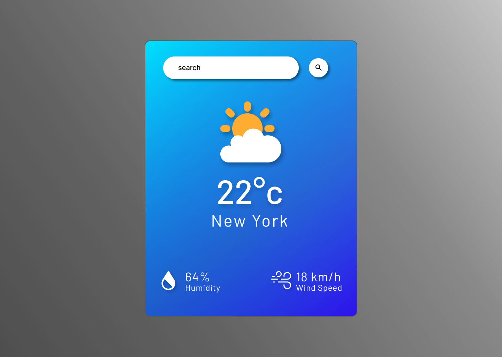

# Weather Webpage 🌤️  

  
    

  

A simple weather webpage that allows users to enter a country name and instantly get the temperature, humidity, and wind speed. The design is responsive, visually appealing, and created with modern web standards.  

## Features  
- 🌎 Search for a country to get real-time weather details.  
- 📊 Displays:  
  - Temperature (°C)  
  - Humidity (%)  
  - Wind Speed (km/h)  
- 🖌️ Designed using **Figma** with a clean and user-friendly interface.  
- 📱 Fully responsive design for mobile, tablet, and desktop.  

## Live Demo  
[**View the Live Project**](https://dark1arrow.github.io/weather-web-page/)  

## Figma Design  
[**View Figma Design**](https://www.figma.com/design/rervNKegOt7yXEDeSnH9UC/java-script-project?node-id=25-43&t=MsM37kkix7ldWsq1-1)  

## LinkedIn Post  
[**Check LinkedIn**](https://www.linkedin.com/in/gouatm-khanna-61ba63262/?utm_source=share&utm_campaign=share_via&utm_content=profile&utm_medium=android_app)
  

## Technologies Used  
- **HTML5**  
- **CSS3**  
- **JavaScript**  
- **Weather API**  
